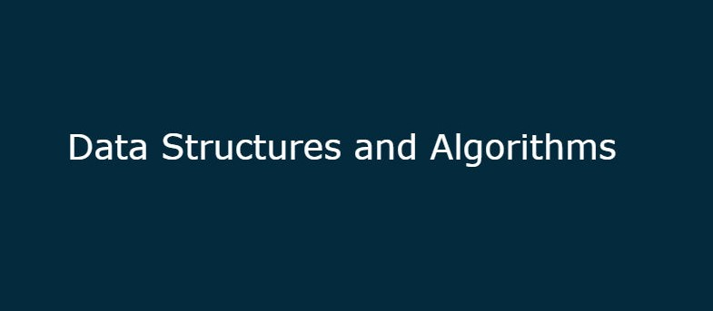

> This repository contains the implementations of commonly used data structures and algorithms.
# Table of Contents
- [ ] Arrays
- [ ] LinkedLists
- [ ] Stacks
- [ ] Queues
- [ ] Trees
- [ ] Priority Queues and Heaps
- [ ] Disjoint Sets
- [ ] Graph Algorithms
- [ ] Sorting
- [ ] Searching
- [ ] Hashing
- [ ] String Algorithms
- [ ] Greedy 
- [ ] Dynamic Programming
- [ ] Miscellaneous
